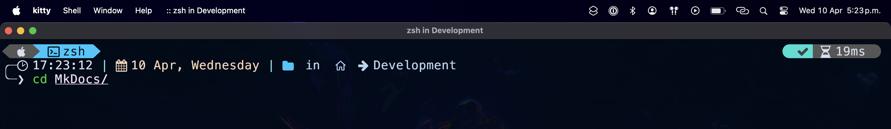

1. Primero debes acceder a tu cuenta de [Github](https://github.com/login), en la ventana de bienvenida debes ubicar la manera de crear un repositorio, a la fecha de creación de esta guía la creación se realiza desde la sección "Start Writing Code" como te señalamos en la siguiente imagen. 

    

2. Una vez localices el apartado correspondiente deberás darle un nombre a tu repositorio (en nuestro caso "MkDocs") y seleccionar la visibilidad (en nuestro caso será un repositorio "Public"). En cuanto hayas indicado esos valores da click en el botón "Create a New Repository".

    

3. En cuanto crees el repositorio podrás acceder al parámetro que permite clonarlo en nuestro equipo, asegurate que la opción de "Quick Setup" tenga seleccionado "SSH" y copia el valor correspondiente. 

    

4. En tu terminal ejecuta el siguiente comando sustituyendo por tu valor correspondiente.
    ```BASH
    git clone git@github:<USUARIO>/<REPOSITORIO>.git
    ```
    
    

    Una vez se haya copiado el repositorio deberas ver un mensaje como el siguiente.

    

5. Cambia tu directorio de trabajo al del repositorio recien copiado.
    ```BASH
    cd <Repositorio>
    ```
    


6. Crea un [entorno virtual](https://docs.python.org/es/3/tutorial/venv.html) mediante el siguiente comando:

    ```BASH
    python3 -m venv .venv
    ```
    

7. Activa tu entorno virtual con:
    ```BASH
    source .venv/bin/activate
    ```
    

8. Asegurate de tener instalado el gestor `pip`con:
    ```BASH
    pip --version
    ```    
    

9. Instala el generador de sitios con el comando:
    ```BASH
    pip install mkdocs-material
    ```    
    

    Se generará una serie de líneas con notas de lo que está haciendo el instalador, espera a que termine. 

    

10. Abre tu carpeta en el editor VS Code.

    ```BASH
    code .
    ```
    
        
    

11. Regresa a tu terminal para generar un nuevo sitio mediante este comando:
    ```BASH
    mkdocs new .
    ```
    

    Se generará una carpeta llamada docs, con un archivo llamado "index.md" y en la raíz se generará un archivo llamado "mkdocs.yml".

    

    
    
12. Ejecute un servidor temporal mediante el siguiente comando:
    ```BASH
    mkdocs serve
    ```    
    
        
    

13. Visite el sitio que indicó su consola, generalmente será [http://172.0.0.1:8000/](http://172.0.0.1:8000/)    
    
14. Añada el tema "material" en su archivo `mkdocs.yml`.    
    
15. Actualice el sitio y vea el nuevo formato.    
    

16. Detenga la ejecución del servidor y copie el siguiente contenido en su archivo `mkdocs.yml`

    ```YAML
    site_name: Guía MKDocs con Material
    #site_url: 
    theme:
    name: material
    #  logo: 
    #  favicon: 
    features:
        - navigation.tabs
        - navigation.sections
        - navigation.expand
        - toc.integrate
        - navigation.top
        - search.suggest
        - search.highlight
        - content.tabs.link
        - content.code.annotation
        - content.code.copy
    language: es
    palette:
        - scheme: default
        toggle:
            icon: material/toggle-switch-off-outline 
            name: Switch to dark mode
        primary: pink
        accent: red 
        - scheme: slate 
        toggle:
            icon: material/toggle-switch
            name: Switch to light mode    
        primary: pink
        accent: pink

    plugins:
    - social
    - search

    extra:
    social:
        - icon: fontawesome/brands/discord
        #  link: 
        - icon: fontawesome/brands/github-alt
        #  link: 
        - icon: fontawesome/brands/linkedin
        #  link: 

    markdown_extensions:
    - pymdownx.highlight:
        anchor_linenums: true
    - pymdownx.inlinehilite
    - pymdownx.snippets
    - admonition
    - pymdownx.arithmatex:
        generic: true
    - footnotes
    - pymdownx.details
    - pymdownx.superfences
    - pymdownx.mark
    - attr_list
    - pymdownx.emoji:
        emoji_index: !!python/name:material.extensions.emoji.twemoji
        emoji_generator: !!python/name:materialx.emoji.to_svg

    #copyright: |
    

    extra_javascript:
    - https://polyfill.io/v3/polyfill.min.js?features=es6
    - https://cdn.jsdelivr.net/npm/mathjax@3/es5/tex-mml-chtml.js

    ```

17. Ejecute el siguiente comando en su terminal
    ```BASH
    pip install "mkdocs-material[imaging]"
    ```
    

18. Vuelva a habilitar el servidor:
    ```BASH
    mkdocs serve
    ```
19. Su sitio debería verse así:

    

