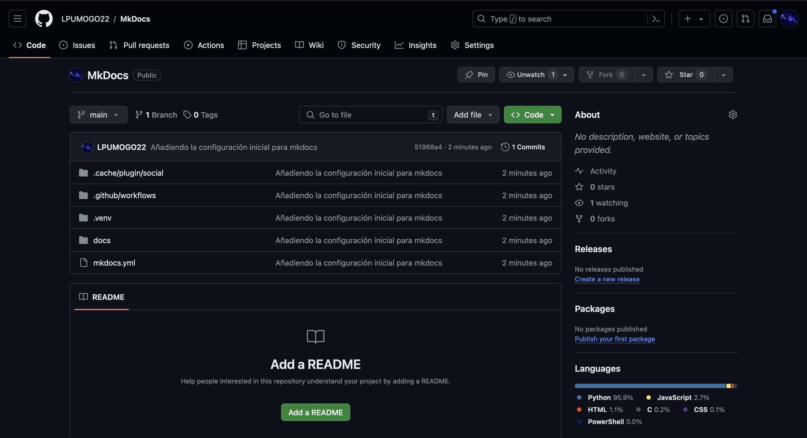

1. Crea el directorio `.github` a nivel raíz del proyecto.

    ```BASH
    mkdir .github
    ```
    

2. Crea el directorio `workflows` dentro de `.github`.

    ```BASH
    mkdir .github/workflows
    ```
    

3. Crea el fichero `ci.yml` dentro de `workflows`.
    ```BASH
    touch .github/workflows/ci.yml
    ```
    

    Deberías poder ver la siguiente estructura en tu editor de código:

     

4. Copia el siguiente código en el fichero `ci.yml` para automatizar la compilación y despliegue de tu sitio cada que hagas un `push`a github. 

    ```YAML
    name: ci 
    on:
        push:
            branches:
                - master 
                - main
    permissions:
        contents: write
    jobs:
        deploy:
            runs-on: ubuntu-latest
            steps:
                - uses: actions/checkout@v3
                - uses: actions/setup-python@v4
                  with:
                    python-version: 3.x
                - uses: actions/cache@v2
                  with:
                    key: ${{ github.ref }}
                    path: .cache
                - run: pip install mkdocs-material
                - run: pip install pillow cairosvg
                - run: mkdocs gh-deploy --force
    ```

5. Añade el contenido a los archivos que rastrea github con el siguiente comando:

    ```BASH
    git add -A
    ```

6. Realiza un commit del estado actual de tu sitio:

    ```BASH
    git commit -m "Añadiendo la configuración inicial para mkdocs"
    ```

7. Manda tu versión a github:

    ```BASH
    git push origin main
    ```

8. Dirigete al repositorio en Github

    

9. Da click en el apartado "settings".

    

10. En el menú lateral busca la opción "pages".

    
